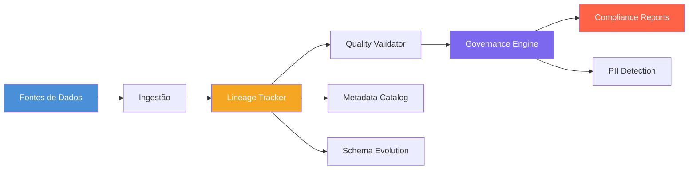

<div align="center">

# ML Data Lineage & Governance

**Plataforma de rastreamento de linhagem de dados e governança para pipelines de Machine Learning**

**Data lineage tracking and governance platform for Machine Learning pipelines**

[](https://www.python.org/downloads/)
[](LICENSE)
[](Dockerfile)

[Português](#português) | [English](#english)

</div>

---

## Português

### Visão Geral

Plataforma completa para rastreamento de linhagem de dados, validação de qualidade, governança e conformidade regulatória em pipelines de Machine Learning. O sistema acompanha dados desde a ingestão bruta até as predições do modelo, identificando dependências, detectando informações sensíveis e gerando relatórios de conformidade com LGPD e GDPR.

### Arquitetura



### Componentes

| Módulo | Descrição |
|--------|-----------|
| **Lineage Tracker** | Rastreamento end-to-end de transformações de dados usando um grafo acíclico dirigido (DAG) |
| **Lineage Graph** | Estrutura de grafo com travessia upstream/downstream e análise de impacto |
| **Quality Validator** | Motor de validação baseado em regras (nulidade, unicidade, faixa, regex, integridade referencial) |
| **Data Profiler** | Geração de estatísticas por coluna com detecção de anomalias e comparação de schemas |
| **Compliance Engine** | Detecção de PII (email, CPF, telefone, cartão de crédito) e verificação LGPD/GDPR |
| **Metadata Catalog** | Registro versionado de datasets, modelos e features com busca por tags e proprietário |
| **Schema Evolution** | Detecção de mudanças de schema, verificação de compatibilidade e sugestões de migração |

### Instalação

```bash
git clone https://github.com/galafis/ml-data-lineage-governance.git
cd ml-data-lineage-governance
pip install -r requirements.txt
```

### Uso Rápido

```bash
# Executar demo completa
python main.py

# Executar testes
python -m pytest tests/ -v

# Com Docker
docker-compose -f docker/docker-compose.yml up
```

### Exemplo de Saída

**Grafo de Linhagem (formato DOT):**

```
digraph CreditRiskLineage {
  rankdir=LR;
  "ds_raw_customers" [label="Raw Customer Data\n[dataset]", shape=cylinder];
  "ds_clean_customers" [label="Cleaned Customer Data\n[dataset]", shape=cylinder];
  "ft_customer_features" [label="Customer Feature Set\n[feature]", shape=parallelogram];
  "mdl_credit_risk" [label="Credit Risk Classifier\n[model]", shape=hexagon];
  "pred_credit_scores" [label="Credit Score Predictions\n[prediction]", shape=diamond];
  "ds_raw_customers" -> "ds_clean_customers" [label="clean_and_impute"];
  "ds_clean_customers" -> "ft_customer_features" [label="feature_engineering"];
  "ft_customer_features" -> "mdl_credit_risk" [label="model_training"];
  "mdl_credit_risk" -> "pred_credit_scores" [label="model_inference"];
}
```

**Relatório de Conformidade (LGPD):**

```json
{
  "dataset_name": "raw_customers",
  "framework": "lgpd",
  "overall_compliant": false,
  "risk_level": "critical",
  "summary": {
    "total_columns_scanned": 10,
    "pii_columns_found": 4,
    "pii_types_found": ["email", "cpf", "phone_br", "name"]
  },
  "recommendations": [
    "Criptografar ou aplicar hash em endereços de email.",
    "Dados de CPF exigem criptografia conforme Art. 46 da LGPD.",
    "Manter Registro de Atividades de Tratamento (ROPA)."
  ]
}
```

**Análise de Impacto:**

```
Nó de origem: ds_raw_customers
Total de nós afetados: 4
Caminhos afetados:
  ds_raw_customers -> ds_clean_customers -> ft_customer_features -> mdl_credit_risk -> pred_credit_scores
```

### Aplicações na Indústria

- **Conformidade regulatória financeira** — Rastreamento de linhagem para auditorias do Banco Central, detecção de dados sensíveis em relatórios de risco de crédito
- **Governança de dados em saúde** — Validação de qualidade de dados clínicos, conformidade com requisitos de privacidade e retenção de dados de pacientes
- **Catálogo de dados para e-commerce** — Registro centralizado de datasets de clientes, produtos e transações com controle de versão
- **Trilha de auditoria para modelos de ML** — Rastreabilidade completa desde dados brutos até predições, facilitando explicabilidade e reprodutibilidade
- **Conformidade LGPD/GDPR** — Detecção automática de PII, políticas de retenção de dados e geração de relatórios para autoridades regulatórias

---

## English

### Overview

A comprehensive platform for data lineage tracking, quality validation, governance, and regulatory compliance in Machine Learning pipelines. The system traces data from raw ingestion through to model predictions, mapping dependencies, detecting sensitive information, and generating compliance reports for LGPD and GDPR.

### Architecture


### Components

| Module | Description |
|--------|-------------|
| **Lineage Tracker** | End-to-end data transformation tracking using a directed acyclic graph (DAG) |
| **Lineage Graph** | Graph structure with upstream/downstream traversal and impact analysis |
| **Quality Validator** | Rule-based validation engine (not-null, unique, range, regex, referential integrity) |
| **Data Profiler** | Per-column statistics with anomaly detection and schema comparison |
| **Compliance Engine** | PII detection (email, CPF, phone, credit card) and LGPD/GDPR compliance checks |
| **Metadata Catalog** | Versioned registry of datasets, models, and features with tag-based search |
| **Schema Evolution** | Schema change detection, compatibility checks, and migration suggestions |

### Installation

```bash
git clone https://github.com/galafis/ml-data-lineage-governance.git
cd ml-data-lineage-governance
pip install -r requirements.txt
```

### Quick Start

```bash
# Run the full demo
python main.py

# Run tests
python -m pytest tests/ -v

# With Docker
docker-compose -f docker/docker-compose.yml up
```

### Example Output

**Lineage Graph (DOT format):**

```
digraph CreditRiskLineage {
  rankdir=LR;
  "ds_raw_customers" [label="Raw Customer Data\n[dataset]", shape=cylinder];
  "ds_clean_customers" [label="Cleaned Customer Data\n[dataset]", shape=cylinder];
  "ft_customer_features" [label="Customer Feature Set\n[feature]", shape=parallelogram];
  "mdl_credit_risk" [label="Credit Risk Classifier\n[model]", shape=hexagon];
  "pred_credit_scores" [label="Credit Score Predictions\n[prediction]", shape=diamond];
  "ds_raw_customers" -> "ds_clean_customers" [label="clean_and_impute"];
  "ds_clean_customers" -> "ft_customer_features" [label="feature_engineering"];
  "ft_customer_features" -> "mdl_credit_risk" [label="model_training"];
  "mdl_credit_risk" -> "pred_credit_scores" [label="model_inference"];
}
```

**Compliance Report (LGPD):**

```json
{
  "dataset_name": "raw_customers",
  "framework": "lgpd",
  "overall_compliant": false,
  "risk_level": "critical",
  "summary": {
    "total_columns_scanned": 10,
    "pii_columns_found": 4,
    "pii_types_found": ["email", "cpf", "phone_br", "name"]
  },
  "recommendations": [
    "Encrypt or hash email addresses at rest.",
    "CPF data requires encryption per LGPD Art. 46.",
    "Maintain a Record of Processing Activities (ROPA)."
  ]
}
```

**Impact Analysis:**

```
Source node: ds_raw_customers
Total affected nodes: 4
Affected paths:
  ds_raw_customers -> ds_clean_customers -> ft_customer_features -> mdl_credit_risk -> pred_credit_scores
```

### Industry Applications

- **Financial regulatory compliance** — Lineage tracking for central bank audits, sensitive data detection in credit risk reports
- **Healthcare data governance** — Clinical data quality validation, compliance with patient data privacy and retention requirements
- **E-commerce data catalog** — Centralized registry of customer, product, and transaction datasets with version control
- **ML model audit trails** — Full traceability from raw data to predictions, enabling explainability and reproducibility
- **LGPD/GDPR compliance** — Automated PII detection, data retention policies, and report generation for regulatory authorities

### Project Structure

```
ml-data-lineage-governance/
├── main.py                        # End-to-end demo
├── conftest.py                    # Pytest root config
├── requirements.txt
├── setup.py
├── Makefile
├── config/
│   └── governance_config.yaml     # Governance configuration
├── docker/
│   ├── Dockerfile
│   └── docker-compose.yml
├── src/
│   ├── __init__.py
│   ├── lineage/
│   │   ├── graph.py               # DAG structure and traversal
│   │   └── tracker.py             # High-level lineage tracking API
│   ├── quality/
│   │   ├── validator.py           # Rule-based data quality validation
│   │   └── profiler.py            # Statistical profiling and schema detection
│   ├── governance/
│   │   ├── compliance.py          # PII detection and compliance engine
│   │   └── catalog.py             # Metadata catalog with versioning
│   ├── schema/
│   │   └── evolution.py           # Schema evolution and compatibility
│   └── utils/
│       └── logger.py              # Structured logging
└── tests/
    ├── test_lineage_graph.py
    ├── test_lineage_tracker.py
    ├── test_quality_validator.py
    ├── test_profiler.py
    ├── test_compliance.py
    ├── test_catalog.py
    └── test_schema_evolution.py
```

### Technologies

- **Python 3.10+** — Core language
- **pandas** — Tabular data processing and validation
- **NumPy** — Numerical operations and statistical calculations
- **pytest** — Testing framework

### Author

**Gabriel Demetrios Lafis**

### License

This project is licensed under the MIT License.
